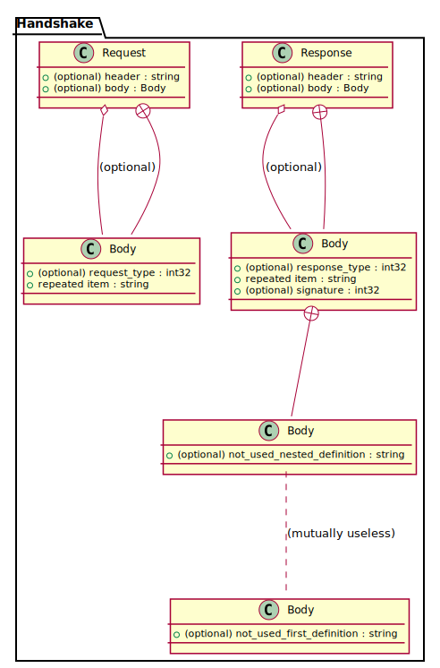

# pro2pu - Protobuf to PlantUML converter

Parses protobuf files and generates plantuml class diagrams,
which plantuml can convert to images.
Supports protobuf syntax versions 2 and 3.

## Usage

Call the ```pro2pu``` executable on a single ```.proto``` file to generate a ```.puml``` file.
It will look for imported files in the working directory and resolve cyclic dependencies.

```pro2pu --help``` will show the following usage information:

    Usage: target/pro2pu [options] parameters
      Items marked with * may be repeated.
      Options:
        --help           Display this usage message
        --version        Display version and exit
        -uint            Hide (-u0) or show (-u1) usage relation [default: 1]
        --usage=int      Hide (-u0) or show (-u1) usage relation [default: 1]
        -iint            Hide (-i0) or show (-i1) inner message relation [default: 1]
        --inner=int      Hide (-i0) or show (-i1) inner message relation [default: 1]
        -Istring         Include directory imports*
        --include=string Include directory imports*
      Parameters:
        FileName         File to be processed

Add parameter ```--include=somedir``` (or ```-Isomedir```) to specify an additional directory in which to look for imports. Repeat the option for multiple directories. Lookup order for unqualified imports in ```.proto``` files is as follows:

1. the directory of the including file
2. the current working directory
3. the include directories in their given order

Only 1 input file can be passed as starting point to the compiler; if you have a collection of files, consider bundling them in an ```index.proto``` file.

The compiler output will contain a class for every message and enum, and special sections for protobuf's union type ```oneof```. Classes and enums will be assigned their respective package.

Edges can be controlled with the options ```--usage=``` and ```--inner=```.

By default, an edge will be inserted for every use of a user-defined message/enum; set ```--usage=0``` to turn usage edges.
Moreover, an edge will be inserted between every sub-message and its enclosing message; set ```--inner=0``` to turn of embedding edges.

Verbatim PlantUML code can be inserted into the ```.puml```-file in single-line comments starting with ```//#```.

## Examples

The following graphic shows the example [tutorial.proto](https://developers.google.com/protocol-buffers/docs/reference/proto2-spec#proto_file) from the protobuf 2 documentation


### Example 2

This example shows embedded messages and verbatim comments.
 ```//#``` starts a verbatim comment in ```pro2pu```; apostrophe ```'``` starts a single-line comment in PlantUML.

 To represent nested messages uniquely in PlantUML, ```pro2pu``` generates the fully qualified name for every type. It uses dot ```.``` to separate packages from messages, and dollar ```$``` to separate messages from nested sub-messages.

```proto
syntax = "proto3";
package Handshake;

message Body {
  string not_used_first_definition = 1;
}

message Response {
  string header = 1;
  Body body = 2;

  message Body {
    int32 response_type = 1;
    repeated string item = 2;
    int32 signature = 3; //# 'refer to A

    message Body {
      string not_used_nested_definition = 1;
    }
  }
}

message Request {
  string header = 1; //# 'refer to BCDEFGH
  Body body = 2;

  message Body {
    int32 request_type = 1;
    repeated string item = 2; //#Handshake.Response$Body$Body..Handshake.Body : (mutually useless)
  }
}
```




## Prerequisites

- the ELI compiler generation toolkit of version 4.8.1 (https://eli-project.sf.net) for generating C-code from specification
- a C-compiler
- Tcl/Tk development libraries, if you want to visually debug the compiler (via ```make mon```)

Please set the path to the ELI executable binary in the project Makefile.

## Building

Run ```make exe``` to build the ```target/pro2pu``` executable.

Run ```make source``` to generate C source code and a Makefile for export and compilation on e.g. MacOS, Windows. Some adjustments to the C sources may be needed for the Visual C compiler.

### Errors during build

If ELI fails with message ```Cannot connect to Odin server.```,
then run ```eli -r``` or ```make connect_to_odin```.

# Appendix

## Errors in the protobuf specs

The parser has been built to spec, however
the protobuffer specification for syntax levels 2 and 3
contradicts its own examples in the cases detailed below.

The compiler follows the grammar rules for groups in the first case,
and the rules induced by example for reserved in the second case.

### Groups

The example file at the bottom of page https://developers.google.com/protocol-buffers/docs/reference/proto2-spec
has the field:

    optional group GroupMessage {
        optional a = 1;
      }

This is not valid syntax, according to the production rules given on the same page:

    group = label "group" groupName "=" fieldNumber messageBody

and

    field = label type fieldName "=" fieldNumber [ "[" fieldOptions "]" ] ";"


A group declaration must always supply a ```fieldNumber``` (missing in example).
And a field definition must always supply a ```type``` (missing in example).

Thus a corrected version of the example is as follows:

    optional group GroupMessage = 1 { // fixed
        optional Sometype a = 1;        // fixed
      }

Curiously though, the ```protoc``` compiler of ```libprotoc 3.0.0``` does not complain about the example file.

### Reserved

The example given in section ```reserved``` (https://developers.google.com/protocol-buffers/docs/reference/proto2-spec#reserved) is as follows:

    reserved 2, 15, 9 to 11;
    reserved "foo", "bar";

This is not valid syntax, according to the grammar productions given immediately above the example:

    reserved = "reserved" ( ranges | fieldNames ) ";"
    fieldNames = fieldName { "," fieldName }
where
    ```fieldName = ident```

Reserved keywords cannot be quoted according to the grammar.
The parser implementation will be lenient wrt. reserved names,
as they are not used for compiling to PUML.

## Syntax differences between proto2 and proto3

The parser supports both syntax2 and syntax3, if the ```.proto``` file correctly declares the dialect it is using.
Here we list the differences in grammar specification between the syntax versions.


Productions dropped from proto2 to proto3:

    capitalLetter = "A" ... "Z"
    streamName = ident
    groupName = capitalLetter { letter | decimalDigit | "_" }
    label = "required" | "optional" | "repeated"
    group = label "group" groupName "=" fieldNumber messageBody
    extensions = "extensions" ranges ";"
    extend = "extend" messageType "{" {field | group | emptyStatement} "}"
    stream = "stream" streamName "(" messageType "," messageType ")" (( "{" { option | emptyStatement } "}") | ";" )

Production ```syntax``` has changed, obviously:

    syntax = "syntax" "=" quote "proto2" quote ";"

    syntax = "syntax" "=" quote "proto3" quote ";"

Production ```field``` has changed:

  Reflecting the omission of ```label```, the declaration of ```repeatable``` moved into production ```field```.

    field = label type fieldName "=" fieldNumber [ "[" fieldOptions "]" ] ";"

    field = [ "repeated" ] type fieldName "=" fieldNumber [ "[" fieldOptions "]" ] ";"

Production ```messageBody``` has changed:

  Reflecting the omiision of ```extend```, ```extensions```, and ```group```, the production dropped some RHS's.

    messageBody = "{" { field | enum | message | extend | extensions | group |
    option | oneof | mapField | reserved | emptyStatement } "}"

    messageBody = "{" { field | enum | message | option | oneof | mapField |
    reserved | emptyStatement } "}"

Production ```service``` has changed:

  Stream services have been removed.
    
    service = "service" serviceName "{" { option | rpc | stream | emptyStatement } "}"

    service = "service" serviceName "{" { option | rpc | emptyStatement } "}"

  Curiously, rpc streams are retained in ```proto3```:
  
    rpc = "rpc" rpcName "(" [ "stream" ] messageType ")" "returns" "(" [ "stream" ]

Production ```topLevelDef``` has changed:

  Reflecting the omission of ```extend```.

    topLevelDef = message | enum | extend | service

    topLevelDef = message | enum | service

