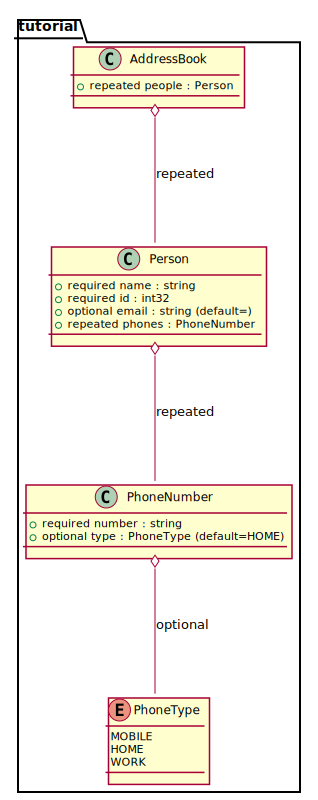

# pro2pu - Protobuf to PlantUML converter

A parser for protobuf files and compiler to plantuml files.
Supports protobuf syntax 2 and 3.
Generate simple class diagrams which can be converted to images with plantuml.

Importing of files is supported (must be in cwd). Cyclic dependencies are resolved.

## Examples

[tutorial.proto](https://developers.google.com/protocol-buffers/docs/reference/proto2-spec#proto_file) from the protobuf 2 documentation



## Prerequisites

The compiler is built from ELI-specification. ELI is a compiler generator toolkit, not just a parser generator.

ELI generates C-code from the specification, which is then compiled to binary with GCC.
ELI is available at (https://eli-project.sf.net), and must be built from source.
If you want to debug the C-code generation process, it is helpful to have Tcl/Tk development libraries installed before building ELI, so that the target ```make mon``` will work.

Please adjust the Makefile after building ELI, and set the path to the ELI executable binary.

## Building

Run ```make exe``` to build the ```target/pro2pu``` executable.

Run ```make source``` to generate C source code and a Makefile for export and compilation on e.g. MacOS, Windows. Some adjustments to the C sources may be needed under Windows

### Errors during build

If ELI fails with message ```Cannot connect to Odin server.```,
then run ```eli -r``` or ```make connect_to_odin```.

# Appendix

## Errors in the specs

The parser has been built to spec, however
the protobuffer specification for syntax levels 2 and 3
contradicts its own examples in the cases detailed below.

### Groups

The example file at the bottom of page https://developers.google.com/protocol-buffers/docs/reference/proto2-spec
has the field:

    optional group GroupMessage {
        optional a = 1;
      }

This is not valid syntax, according to the production rules given on the same page:

    group = label "group" groupName "=" fieldNumber messageBody

and

    field = label type fieldName "=" fieldNumber [ "[" fieldOptions "]" ] ";"


A group declaration must always supply a ```fieldNumber``` (missing in example).
And a field definition must always supply a ```type``` (missing in example).

Thus a corrected version of the example is as follows:

    optional group GroupMessage = 1 { // fixed
        optional Sometype a = 1;        // fixed
      }

Curiously though, the ```protoc``` compiler of ```libprotoc 3.0.0``` does not complain about the example file.

### Reserved

The example given in section ```reserved``` (https://developers.google.com/protocol-buffers/docs/reference/proto2-spec#reserved) is as follows:

    reserved 2, 15, 9 to 11;
    reserved "foo", "bar";

This is not valid syntax, according to the grammar productions given immediately above the example:

    reserved = "reserved" ( ranges | fieldNames ) ";"
    fieldNames = fieldName { "," fieldName }
where
    fieldName = ident

Reserved keywords cannot be quoted according to the grammar.
The parser implementation will be lenient wrt. reserved names,
as they are not used for compiling to PUML.

## Syntax differences between proto2 and proto3

The parser supports both syntax2 and syntax3, if the ```.proto``` file correctly declares the dialect it is using.
Here we list the differences in grammar specification between the syntax versions.


Productions dropped from proto2 to proto3:

    capitalLetter = "A" ... "Z"
    streamName = ident
    groupName = capitalLetter { letter | decimalDigit | "_" }
    label = "required" | "optional" | "repeated"
    group = label "group" groupName "=" fieldNumber messageBody
    extensions = "extensions" ranges ";"
    extend = "extend" messageType "{" {field | group | emptyStatement} "}"
    stream = "stream" streamName "(" messageType "," messageType ")" (( "{" { option | emptyStatement } "}") | ";" )

Production ```syntax``` has changed, obviously:

    syntax = "syntax" "=" quote "proto2" quote ";"

    syntax = "syntax" "=" quote "proto3" quote ";"

Production ```field``` has changed:

  Reflecting the omission of ```label```, the declaration of ```repeatable``` moved into production ```field```.

    field = label type fieldName "=" fieldNumber [ "[" fieldOptions "]" ] ";"

    field = [ "repeated" ] type fieldName "=" fieldNumber [ "[" fieldOptions "]" ] ";"

Production ```messageBody``` has changed:

  Reflecting the omiision of ```extend```, ```extensions```, and ```group```, the production dropped some RHS's.

    messageBody = "{" { field | enum | message | extend | extensions | group |
    option | oneof | mapField | reserved | emptyStatement } "}"

    messageBody = "{" { field | enum | message | option | oneof | mapField |
    reserved | emptyStatement } "}"

Production ```service``` has changed:

  Stream services have been removed.
    
    service = "service" serviceName "{" { option | rpc | stream | emptyStatement } "}"

    service = "service" serviceName "{" { option | rpc | emptyStatement } "}"

  Curiously, rpc streams are retained in ```proto3```:
  
    rpc = "rpc" rpcName "(" [ "stream" ] messageType ")" "returns" "(" [ "stream" ]

Production ```topLevelDef``` has changed:

  Reflecting the omission of ```extend```.

    topLevelDef = message | enum | extend | service

    topLevelDef = message | enum | service

